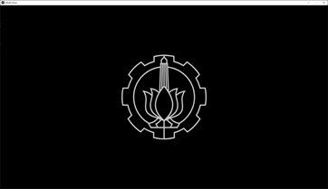
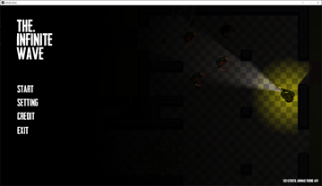
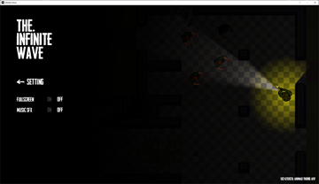
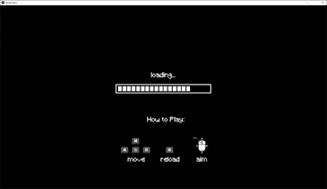
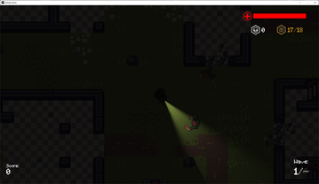
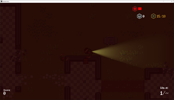

# Infinite Wave - SFML Game
Created by Akhmad Thoriq Afif as part of Advanced Programming Final Project

## Screenshoot

## Additional Credit
+ rileygombart - Player and Zombie Sprites
+ adamatomic - Jawbreaker Tile Map
+ freepik.com - Button
+ 222464 - LTBL2
+ Stéphane F - Music for Roleplaying Volume 2